# Godot MCP Server — Architecture

> **Architecture as of `d1c2a70`** — 41n-series finalization: the full post-`af9c5b4`
> delta reconciled into this doc. Deterministic startup port-config (`startup/cliArgs` +
> `portConfig` + `startupEnv` + `reconcile`; precedence CLI > env > discovery > default,
> plus a fail-fast registry desync cross-check on a pinned-port mismatch), the `ErrorCode`
> union alignment (`AUTH_FAILED` added, dead `NO_RUNTIME_URL` dropped, sync target
> repointed to the toolkit `MCPToolkitError.CODES`), the honest path-guard scope (lexical
> canonicalization on both sides; OS-symlink resolution out of scope), and version-gated
> `discover_tools` summaries (advertise-matches-register). Structural baseline unchanged
> from the 41n-bis cohesion refactor (thin orchestrators over single-responsibility
> modules; bounded-context `camelCase` folders `shared/ transport/ registration/ groups/
> tools/ extensions/ lsp/ security/ startup/ mcp/`).

This document explains how the server is built, for users and contributors who want
to understand it without reading every TypeScript module. It covers the major
subsystems and their responsibilities, the boundaries between them, the **transport +
contract surface** it shares with the toolkit, and the key design decisions (linked to
the toolkit's ADRs).

The server is the **consumer half** of a two-repo system. It is what an AI assistant
actually speaks **MCP over stdio** to; it forwards every tool call as **JSON-RPC over a
localhost WebSocket** to the companion
[`godot-mcp-toolkit`](https://github.com/NPGameDev/godot-mcp-toolkit) plugin running
inside the Godot editor (and, for playtests, inside the running game). One **side
channel** — the GDScript LSP client — opens its own TCP socket straight to Godot's
language server, bypassing the bridge. The wire contract between the two repos is
summarised in [§15](#15-contract-surface).

---

## Maintaining this document

This file is the **canonical** architecture doc. It renders two ways from one source:

- **On github.com** — browsing to `docs/architecture/` auto-renders this `README.md`,
  Mermaid diagrams included, with **zero setup**. This is the always-available surface.
- **On GitHub Pages** — `just-the-docs` renders the *same* file as the polished,
  searchable front door (nav + native Mermaid). One source, two surfaces — **there is
  no hand-authored HTML twin.**

The rules that keep it honest:

1. **Every diagram is Mermaid source** (a fenced ` ```mermaid ` block) — never a pasted
   image. A raster can show what a UI *looks like*, but **no architectural claim may rest
   on a picture an agent cannot read** (that is how diagrams silently drift out of sync).
2. **Each diagram carries a provenance comment** immediately above its fence:
   `<!-- data-depicts="<source files>" data-verified="<short-sha>" -->`. `data-depicts`
   lists the files the diagram is drawn from; `data-verified` is the commit it was last
   checked-correct against. **Bumping `data-verified` is an attestation** that a human or
   agent re-read the diagram against the code at that SHA — it is never auto-generated.
   The comment is invisible on both render surfaces.
3. **When the architecture changes**, edit the affected diagram's Mermaid source, bump
   its `data-verified`, and update the **document-level stamp** at the top (the SHA + one-
   line definition of the last major architectural change).
4. **Find what to re-check** by grepping `data-depicts` for a file you changed; an
   advisory, non-blocking freshness check (`npm run check:arch`) lists diagrams whose
   depicted files moved since their `data-verified` SHA. It over-flags by design — a false
   re-check costs a glance; a missed drift ships a lying diagram.

Each diagram's own `data-verified` comment is authoritative for when it was last
re-checked against the code — the SHAs vary per diagram.

---

## 1. The big picture

An AI assistant talks **MCP over stdio** to this npm bridge; the bridge talks
**JSON-RPC over a localhost WebSocket** to the toolkit's two servers — one inside the
**editor** (the Editor channel, for authoring) and one inside a **running game** (the
Runtime channel, for runtime inspection). It is **registry-driven**, not a blind port scanner: it reads each
live instance's port from the toolkit's machine-wide `projects.json`. A single
**side channel** — the GDScript LSP client — opens its own TCP socket to Godot's
language server, bypassing the bridge entirely ([§9](#9-the-gdscript-lsp-client)).

<!-- data-depicts="src/index.ts src/transport/bridge.ts src/registry.ts src/lsp/lspClient.ts" data-verified="0ad6009" -->
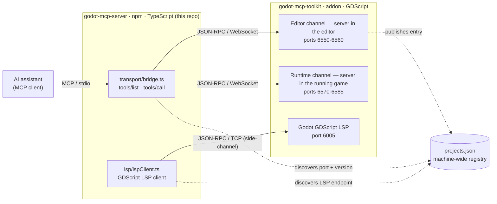
*Figure 1 — system context · verified 0ad6009*

Static `GODOT_MCP_EDITOR_PORT` / `GODOT_MCP_RUNTIME_PORT` / `GODOT_MCP_LSP_PORT` pins (or the
matching `--editor-port` / `--runtime-port` / `--lsp-port` CLI flags) fix a port and
skip the lookup. Everything binds to `127.0.0.1` and is gated by a per-instance auth
token; the real security boundary is **localhost + token + a human at the editor** — the
server-side read-only filter is the one policy layer it adds
([§8](#8-security--trust-boundaries)).

`src/` is organised into bounded-context folders that map almost one-to-one onto the
sections below:

| Folder | Responsibility | Section |
|--------|----------------|---------|
| `shared/` | the kernel: wire types, error codes, version helpers, schema utils | [§5](#5-tool-catalogue-registration--dispatch), [§6](#6-the-response--error-contract) |
| `transport/` | the WebSocket bridge, channel, auth handshake, token path, heartbeat, runtime connection | [§4](#4-transport-the-websocket-bridge) |
| `registration/` | the tool catalogue, the registration choke point, per-call dispatch | [§5](#5-tool-catalogue-registration--dispatch), [§6](#6-the-response--error-contract) |
| `groups/` | the `discover_tools` on-demand tool-group system | [§7](#7-tool-surface-management-discover_tools) |
| `tools/` | the per-domain tool definitions + handlers | [§5](#5-tool-catalogue-registration--dispatch) |
| `extensions/` | third-party extension discovery + live reconcile | [§13](#13-the-extension-system) |
| `lsp/` | the GDScript LSP client, session integrator, status reporter | [§9](#9-the-gdscript-lsp-client) |
| `security/` | read-only profile filter, syntactic path guard, untrusted wrap | [§8](#8-security--trust-boundaries) |
| `startup/` | preflight, registrars, lifecycle, the config + version reconciler | [§3](#3-the-mcp-entrypoint--startup), [§12](#12-cross-version-compatibility) |
| `mcp/` | the MCP prompts / resources / roots capability surfaces | [§3](#3-the-mcp-entrypoint--startup) |
| `index.ts` · `registry.ts` · `registryLiveness.ts` | the composition root, the multi-project registry reader, and its PID + WS-port liveness leaf | [§3](#3-the-mcp-entrypoint--startup), [§11](#11-multi-project-registry) |

---

## 2. Module topology & the decomposition pattern

The defining structural story of this repo is the **41n-bis cohesion refactor**: six
god-files were decomposed into **thin orchestrators over single-responsibility
children**, and then `src/` was reorganised into bounded-context folders with
`camelCase` filenames. The six:

| Was | Became | Iter |
|-----|--------|------|
| `index.ts` (786 LOC) | a ~170-LOC composition root | 062 |
| `bridge.ts` (907) | `bridge` + `channel` + `authHandshake` + `tokenPath` + `heartbeat` + `runtimeConnection` | 068 |
| `tool_helpers.ts` (688) | `registration/{toolRegistry,toolDispatch,toolMeta}` + `shared/{errorContract,schemaCoercion}` | 074 |
| `groups.ts` (1270) | `groups` + 8 siblings + 28 per-group data modules under `groups/defs/` | 077 / 094 |
| `tools/lsp.ts` (730) | a thin tool surface + `lsp/{lspUri,lspLabels,lspSession}` | 083 |
| `extensions.ts` (408) | a ~70-LOC facade + `extension{Command,Registrar,Discovery,Changes}` | 091 |

The **pattern**: a facade/orchestrator (`bridge`, `groups`, `extensions`, the `index`
composition root) constructs, wires, and sequences; the domain logic lives in
single-responsibility siblings. The **dependency direction is one-way** — `index.ts`
(root) → subsystem folders → the `shared/` kernel (`types` / `errors` / `version` /
`schema*`); no folder imports `index.ts`, and `registry.ts` is a shared root-level reader
imported by `transport/`, `lsp/`, and `startup/`, sitting over one leaf of its own —
`registryLiveness.ts`, which takes plain numbers and names no registry symbol, so that
dependency cannot invert. Leaf modules like `groups/groupState.ts` and
`groups/groupCatalogue.ts` exist precisely to break what would otherwise be a
`groups` ↔ `catalogue` cycle.

<!-- data-depicts="src/index.ts src/registry.ts src/registryLiveness.ts src/transport/bridge.ts src/registration/toolRegistry.ts src/groups/groups.ts src/lsp/lspClient.ts src/extensions/extensions.ts src/security/profiles.ts src/startup/registrars.ts src/shared/types.ts src/mcp/prompts.ts" data-verified="0ad6009" -->
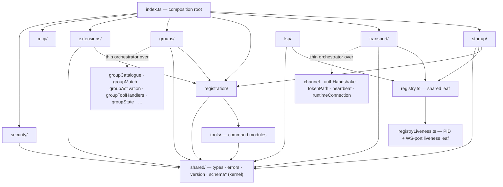
*Figure 2 — module topology + the orchestrator-over-children pattern · verified 0ad6009*

The same shape recurs in `groups/groups.ts` over its nine siblings, `extensions.ts` over
its three services + shared registrar, and `index.ts` over every subsystem it composes.

---

## 3. The MCP entrypoint & startup

`index.ts` is the **composition root** (~175 LOC: "construct + wire + sequence, not
domain logic"). The boot order is load-bearing — the transport connects **last**, so
nothing is advertised before its guards are in place:

<!-- data-depicts="src/index.ts src/startup/startupEnv.ts src/startup/cliArgs.ts src/startup/portConfig.ts src/startup/registrars.ts src/startup/serverMode.ts src/startup/lifecycle.ts src/startup/reconcile.ts src/registration/catalogue.ts" data-verified="eb70bc1" -->
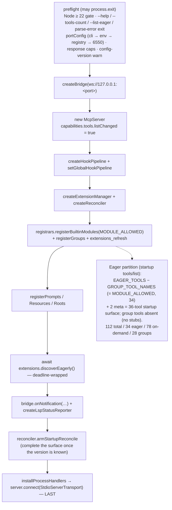
*Figure 3 — composition-root boot order · verified eb70bc1*

- **Preflight** (`startup/startupEnv.ts` + `startup/cliArgs.ts` + `startup/portConfig.ts`) runs
  before anything stateful: a hard Node ≥ 22 gate, the `--help` / `--tools-count` /
  `--list-eager` / parse-error early `process.exit` (editor-independent), port resolution
  (`--editor-port` / `GODOT_MCP_EDITOR_PORT` → `lookupProject` registry hit → `6550` fallback,
  in `portConfig.ts` with precedence CLI > env > discovery > default; pinned values
  validated as integers 1–65535, invalid → exit 1), response cap parse/clamp, and a
  config-version warning.
- **The SDK surface** advertises `capabilities.tools.listChanged: true`. A single
  `batchToolRegistration` collapses a burst of registrations into **one**
  `tools/list_changed` (the primitive lives in `registration/toolRegistry.ts`).
- **The eager / meta / on-demand partition** (a visibility partition over the **one**
  catalogue, not separate pools): the startup `tools/list` is `EAGER_TOOLS −
  GROUP_TOOL_NAMES` (computed once as `MODULE_ALLOWED` in `serverMode.ts`) **plus 2 meta
  tools** (`discover_tools`, `extensions_refresh`, registered directly). On-demand
  **group tools are absent (no stubs)** until `discover_tools` activates them
  ([§7](#7-tool-surface-management-discover_tools)). The counts (also printed by
  `--tools-count`): **112 total / 34 eager / 78 on-demand / 28 groups**; startup surface
  = 36.
- **The cold-start completion** (`startup/reconcile.ts`, concern 071): when the editor
  reports its version *after* eager registration, the startup reconcile re-registers the
  version-gated and extension tools exactly once, fired immediately if the version is
  already known, else via `bridge.onGodotVersionKnown`
  ([§12](#12-cross-version-compatibility)).
- **Lifecycle** (`startup/lifecycle.ts`): SIGINT/SIGTERM close the bridge then exit 0;
  `unhandledRejection` / `uncaughtException` log to stderr but deliberately keep the
  bridge alive.

---

## 4. Transport: the WebSocket bridge

`transport/bridge.ts` is the editor-side facade the whole server calls through. It is a
thin composition root over five SRP siblings: `channel.ts` (the reconnecting,
authenticating, JSON-RPC-correlating primitive — kept whole because correlation and the
reconnect lifecycle co-vary), `authHandshake.ts` (the wire exchange), `tokenPath.ts` (the
per-OS token-file resolver), `heartbeat.ts` (the generic liveness primitive), and
`runtimeConnection.ts` (the playtest-channel aggregate).

A tool call reaches the editor like this:

<!-- data-depicts="src/transport/bridge.ts src/transport/channel.ts src/transport/authHandshake.ts src/registration/toolDispatch.ts" data-verified="d1c2a70" -->
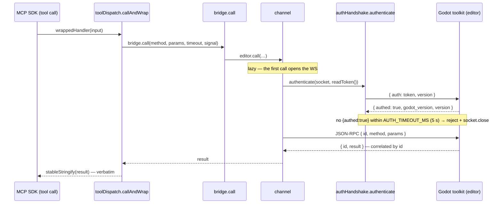
*Figure 4 — connect → auth handshake → dispatch · verified d1c2a70*

The handshake (`authHandshake.ts`) sends `{ auth: token, version }` and resolves on
`{ authed: true }`; the **editor** ack additionally carries `godot_version` + the plugin
`version` (the version-gate input), while a **runtime** ack carries `{ authed: true }`
only. The token is **re-read from disk on every connect** (`tokenPath.ts`, which reads the
toolkit-published `token_path` from the registry and structurally validates it rather than
re-deriving the path — [ADR 0011](#16-key-decisions)), so a rotated token after a plugin
restart is picked up. A version-mismatch check after auth is human-only (stderr), never
on the MCP wire.

The bridge composes a **persistent editor channel** and a **discovered runtime channel**,
each with their own resilience policy:

<!-- data-depicts="src/transport/bridge.ts src/transport/channel.ts src/transport/runtimeConnection.ts src/transport/heartbeat.ts" data-verified="eb70bc1" -->
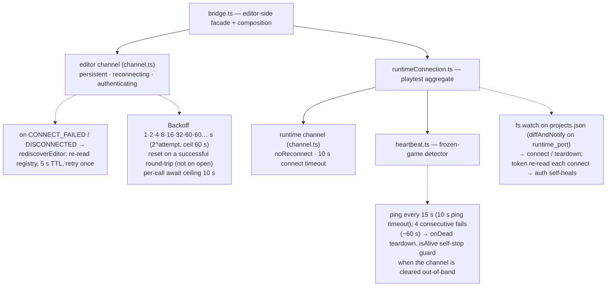
*Figure 5 — the dual-channel bridge: reconnect + heartbeat · verified eb70bc1*

- **Editor channel** — persistent and reconnecting with exponential backoff
  (`1·2·4·8·16·32·60·60…` s; **reset on a successful round-trip, not on open**, so a
  half-broken peer that accepts then drops can't reset backoff every cycle). On
  `CONNECT_FAILED` / `DISCONNECTED` it does **port re-discovery** (`rediscoverEditor`,
  5 s TTL) and retries once against the new channel — unless the port is a pin
  (`GODOT_MCP_EDITOR_PORT` / `--editor-port`), in which case a pinned connect **or
  auth-handshake** failure (a foreign server on the pinned port passes the WS upgrade,
  then fails auth) runs the **fail-fast desync cross-check** (one registry read → a
  precise error naming the mismatch, instead of a silent dead-socket hang).
- **Runtime channel** — discovered, `noReconnect` (a dead game shouldn't be retried),
  with an injected `heartbeat`: ping every **15 s** (10 s ping timeout), **4** consecutive
  fails (~60 s) → proactive teardown. The `isAlive` self-stop guard is load-bearing —
  `callRuntime`/`clearRuntime` can null the channel without stopping the heartbeat,
  relying on the next tick's guard. Discovery is via an `fs.watch` on `projects.json`
  whose `diffAndNotify` reacts **only** to `runtime_port` transitions. A **pinned**
  runtime port (`GODOT_MCP_RUNTIME_PORT` / `--runtime-port`) skips discovery — and since
  no watcher exists to rebuild its channel after a game stop clears it, the next call
  lazily re-creates the channel against the pin. Auth self-heals
  because the token is re-read each connect.

---

## 5. Tool catalogue, registration & dispatch

`registration/catalogue.ts` is the **single source of truth**: `ALL_TOOL_DEFS` is the
deduplicated spread of every per-module `ToolDef` array under `src/tools/`. A CI gate
(`test/sections/01_catalogue.ts`) asserts the GROUP / RUNTIME / LSP routing names are a
subset of `ALL_TOOL_NAMES` and that there are no duplicates, so a tool can never be
counted in one place and missed in another. The human-readable
[tool reference](../tool-reference/README.md) is generated from this same catalogue
(`npm run docs:tools`) — the canonical list of every tool and operation, never
hand-edited.

<!-- data-depicts="src/registration/catalogue.ts src/registration/toolRegistry.ts src/registration/toolDispatch.ts src/security/pathGuard.ts src/shared/version.ts" data-verified="d1c2a70" -->
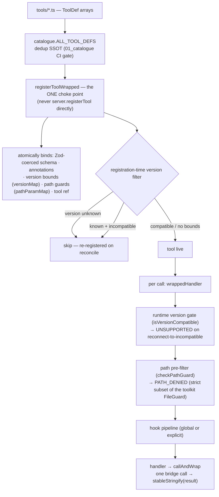
*Figure 6 — catalogue → registration → per-call dispatch · verified d1c2a70*

**The choke point.** Every built-in and extension tool registers through
`registerToolWrapped` (`registration/toolRegistry.ts`) — never `server.registerTool`
directly, which would silently drop every guarantee. One call atomically binds the def +
the coerced Zod schema + annotations + version bounds (`versionMap`) + path guards
(`pathParamMap`) + the tool ref. **The dispatch wrapper** (`wrappedHandler`, built per
tool) runs, on every call: a runtime version gate → a syntactic path pre-filter → the
hook pipeline → the real handler. `callAndWrap` (`registration/toolDispatch.ts`) is the
default body — "one bridge call → JSON-stringify the result". The `name` (snake_case) ⟷
`method` (dotted `domain.verb`) mapping mirrors the toolkit lockstep (C8).

---

## 6. The response & error contract

**REFLECT is the headline posture.** The server forwards the toolkit's result
**verbatim**: `callAndWrap`'s happy path runs `stableStringify(result)` (key-sorted, in
`shared/stableJson.ts`) into a text content block — **no response-schema re-encode**.
`if_exists` / `status` idempotency, the type-tag coercion read-backs, and pagination
fields all pass through transparently. Coercion happens on the **request path only**
(`addStringCoercion`, `shared/schemaCoercion.ts`).

<!-- data-depicts="src/shared/errorContract.ts src/registration/toolDispatch.ts src/shared/types.ts src/shared/stableJson.ts" data-verified="eb70bc1" -->
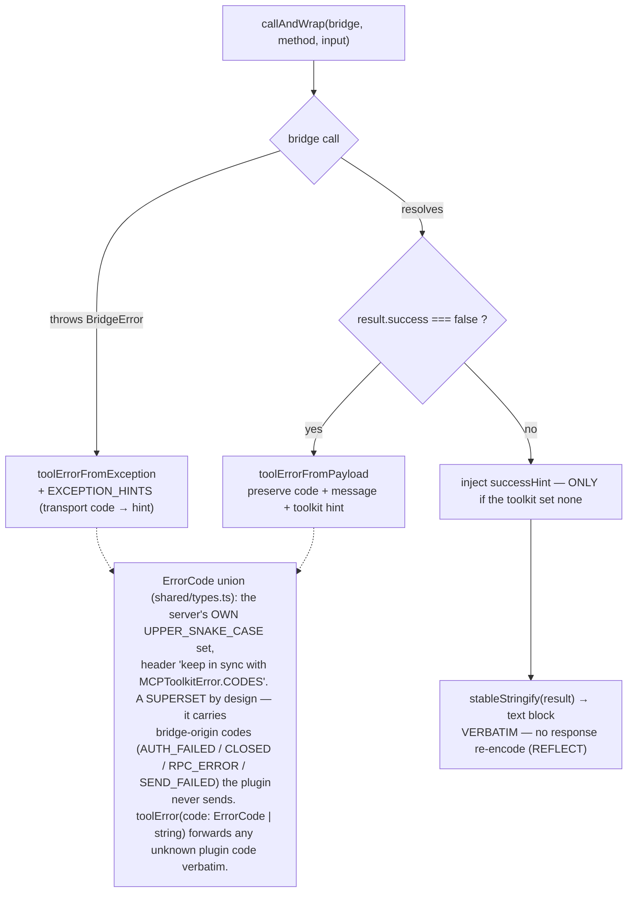
*Figure 7 — the response & error contract (REFLECT) · verified eb70bc1*

**The error path.** A toolkit `{ success: false }` payload becomes a `toolErrorFromPayload`
result that preserves `code` + `message` + the toolkit's `hint`; a thrown `BridgeError`
becomes `toolErrorFromException` + a static `EXCEPTION_HINTS` entry (the
transport-code → recovery-hint map, in `shared/errorContract.ts`). A toolkit-supplied hint
is **never overwritten** — the server's `successHint` injects only when the toolkit set
none.

**The own-enum, string-tolerant wire.** The server keeps its **own**
`UPPER_SNAKE_CASE` `ErrorCode` union (`shared/types.ts`, with a "keep in sync with
`MCPToolkitError.CODES`" header — the toolkit SSOT at
`addons/godot_mcp_toolkit/contract/mcp_toolkit_error.gd`), but `toolError(code: ErrorCode |
string, …)` **forwards any unknown plugin code verbatim**. The union is a **superset by
design** — its header explicitly notes the transport-level codes (`AUTH_FAILED`, `CLOSED`,
`RPC_ERROR`, `SEND_FAILED`) originate in the bridge and never travel through the plugin.
This is documented contract, not drift.

---

## 7. Tool-surface management: `discover_tools`

The on-demand tool surface (28 groups, 78 group tools) is one bounded context carved into
`groups/`: `groupCatalogue.ts` (the static `GROUPS` array assembled from 28 one-per-file
data modules in `groups/defs/`, plus the derived `GROUP_TOOL_NAMES` / `RUNTIME_TOOLS` /
`LSP_TOOLS` index sets and the `allDefs` lookup), `groupMatch.ts` (pure keyword scoring),
`groupActivation.ts` (activate / report / deactivate / describe), `groupToolHandlers.ts`
(the per-tool dispatch fork), `extensionGroups.ts` (the dynamic extension-group mirror),
and the leaves `groupState.ts` / `groupResult.ts` / `groupTypes.ts`. `groups.ts` itself is
the thin `discover_tools` orchestrator over them.

<!-- data-depicts="src/groups/groups.ts src/groups/groupMatch.ts src/groups/groupActivation.ts src/groups/groupCatalogue.ts src/registration/toolRegistry.ts" data-verified="bdcd2a3" -->
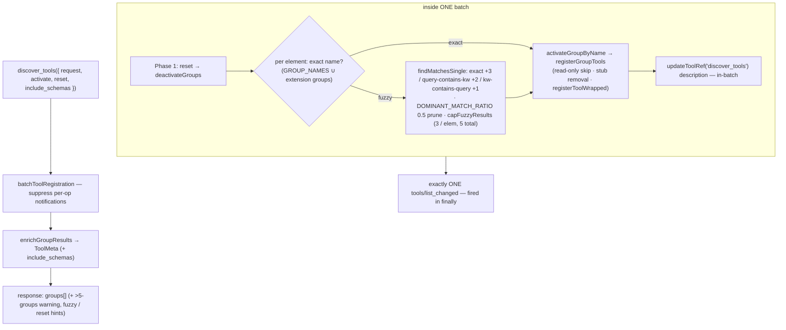
*Figure 8 — the `discover_tools` activation flow · verified bdcd2a3*

**The load-bearing invariant**: one `discover_tools` call — however many groups it
activates and deactivates — emits **exactly one** `tools/list_changed`. All mutation
(reset + activate + the in-batch `discover_tools` description rebuild) happens inside one
`batchToolRegistration`, which monkey-patches `sendToolListChanged` to a no-op and fires
it once in `finally`. The keyword scorer is exactly `exact +3 / query-contains-keyword
+2 / keyword-contains-query (≥ 3 chars) +1`, with a `DOMINANT_MATCH_RATIO` 0.5 recall-
biased prune and a fuzzy cap of 3 per element, 5 total. **Eager-vs-on-demand is a
visibility partition over the one catalogue, not two pools** — `discover_tools` is the
LLM-driven realisation of the dropped Profiles and per-project Tool-Pack ideas.

**Advertise matches register (connected-version-aware summaries).** The group summaries are
built from the *static* catalogue, so they re-apply the same connected-version predicate the
registration gate uses (`isVersionCompatible` over `bridge.getGodotVersion()`,
[§12](#12-cross-version-compatibility)): a built-in the connected editor cannot serve — e.g.
`scene_close` (Godot 4.5+) on a 4.4 editor — is omitted from the activate summary, the browse
summary, and the meta description, so `discover_tools` never advertises a tool that
`tools/list` omits. A version-unknown editor mirrors registration's conservative skip. By
contrast, `--tools-count` is a **pre-connection** static audit that has no connected editor to
gate against, so it is intentionally version-agnostic (it counts the full catalogue) and must
not be "fixed" to filter.

---

## 8. Security & trust boundaries

The server forwards to the authoritative toolkit, so its trust story is thin — one policy
layer (read-only) plus a fast-fail path pre-filter; the toolkit owns the canonical
guards.

**Read-only is server-authoritative and STRICT.** `GODOT_MCP_READ_ONLY=1` drives
`profiles.isExcludedByReadOnly`, applied at **every** registration site — so an excluded
tool is **never registered** (absent from `tools/list`, with **no per-call forward-time
reject**):

<!-- data-depicts="src/security/profiles.ts src/registration/toolRegistry.ts src/groups/groupActivation.ts src/extensions/extensionRegistrar.ts" data-verified="eb70bc1" -->
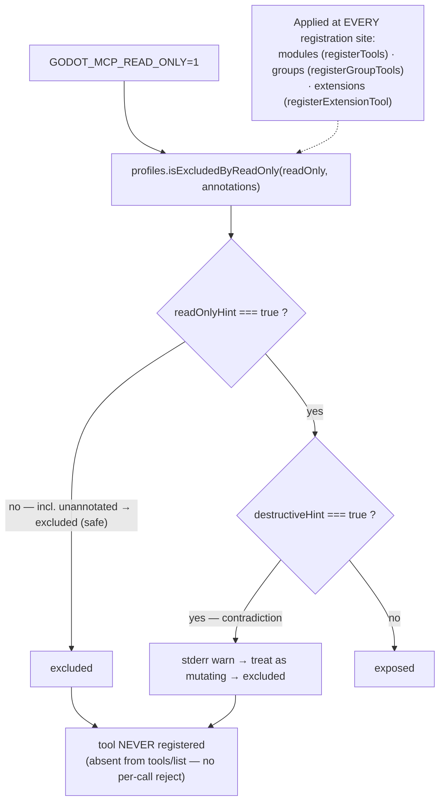
*Figure 9 — read-only enforcement points · verified eb70bc1*

STRICT means a tool is exposed iff `readOnlyHint: true ∧ ¬destructiveHint`; **an
unannotated tool defaults to excluded (safe)**, and the `readOnlyHint ∧ destructiveHint`
contradiction is resolved as treat-as-mutating with a stderr warning. The toolkit does
**not** gate dispatch on the env var — that mirrored-env-var desync was the old
feature-gate bug, removed.

**`pathGuard.ts` is a strict subset** of the toolkit's authoritative `FileGuard` (ADR
0009): a syntactic pre-filter that fast-fails an obviously out-of-bounds path (empty,
an exact `..` segment, an absolute OS path, a missing required prefix) before the WS
round-trip. It deliberately does **not** canonicalize — a subtler path that only the
toolkit's **lexical** canonicalization (`globalize_path` + `simplify_path`) would reject
passes here and is caught downstream (the one accepted server-allow / toolkit-deny
direction; a shared `PATH_FIXTURE` guards the forbidden reverse). OS-symlink resolution is
out of scope on **both** sides — the single-user localhost threat model.

**Untrusted content is REFLECT.** The toolkit does the primary untrusted-content wrap; the
server forwards it verbatim. The server's own `untrusted.ts` is used in **exactly one**
place — `lsp_hover` text (`tools/lsp.ts`) — a **server-originated** wrap because the LSP
text comes straight from the engine over the server's own TCP socket, never transiting the
toolkit's wrapper.

---

## 9. The GDScript LSP client

The GDScript LSP client (`lsp/lspClient.ts`) is a lazily-connected JSON-RPC-over-TCP
client to Godot's built-in language server — the **headline non-finding** of the refactor.
At **~630 LOC it is the largest module in the repository and the one file deliberately kept
above the ~500-LOC cohesion guideline**, because it is genuinely cohesive (a single
JSON-RPC-over-TCP client) and was **not carved**. 083 carved only the *tool layer*:
`lsp/lspUri.ts` (`res://` ↔ `file://`), `lsp/lspLabels.ts` (enum → label maps),
`lsp/lspSession.ts` (the connect/session integrator — `ensureLsp`, the singleton client,
the status-reporter callback, the connect-failure hint, the `withLspDoc` prologue), and
`tools/lsp.ts` (7 defs + handlers + `createLspHandler`).

<!-- data-depicts="src/lsp/lspClient.ts src/lsp/lspSession.ts src/groups/groupToolHandlers.ts src/registry.ts src/registryLiveness.ts src/lsp/lspStatusReporter.ts src/tools/lsp.ts" data-verified="0ad6009" -->
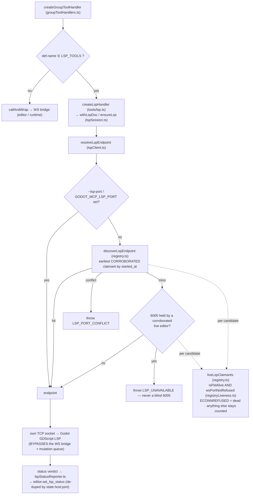
*Figure 10 — LSP endpoint resolution + bridge bypass · verified 0ad6009*

**Three-tier resolution** (`resolveLspEndpoint`, ADR 0008): explicit override
(`--lsp-port` / `GODOT_MCP_LSP_PORT` / `_HOST`, CLI winning over env — the multi-instance
lever) → registry (`discoverLspEndpoint`, the
earliest-live-claimant by `started_at`, else a `conflict`) → **guarded 6005 only if no
live editor holds it, else throw — never a blind 6005**. **The bypass**: the
`groupToolHandlers` dispatch fork routes `LSP_TOOLS` members to `createLspHandler` → the
own TCP client *before* the runtime/`callAndWrap` default, so LSP tools never touch the
WS bridge or the mutation queue (correct — they are read-only and don't touch the scene).

**"Live claimant" means corroborated, not just pid-alive** (ADR 0025). Both registry
tiers share one predicate, `liveLspClaimants`: an entry counts only when its recorded PID
is alive **and** the WS command port *that entry itself advertises* does not refuse a
connection. The PID
check alone cannot carry the verdict — the projection never prunes cross-project editor
entries and they all default to the engine's 6005, so a closed editor whose PID has since
been recycled to any unrelated process would resurrect as a rival claimant, producing a
false `LSP_PORT_CONFLICT` for a project served by exactly one editor (and a false
`LSP_UNAVAILABLE` on the miss path, which shares the predicate). The corroboration probe
is a 300 ms loopback connect closed with a graceful FIN; only `ECONNREFUSED` — positive
proof nothing is listening — removes a claimant. Every other outcome leaves it counted,
because dropping a *genuine* rival would silently serve another project's symbols on Godot
4.2–4.4, which have no root-mismatch backstop. Resolution is therefore `async`.

**Dual port-collision detection**: pre-connect registry ownership (`LSP_PORT_CONFLICT`)
plus a post-initialize 4.5+ `window/showMessage` root-mismatch. **Status push**: the
registry verdict on connect/reconnect (resolution only, no LSP handshake) and a verified
verdict after a real connect, de-duped by `state:host:port`, pushed via
`lsp/lspStatusReporter.ts` → `editor.set_lsp_status` (the editor can't determine its own
LSP bind status). The registry push is fire-and-forget and yields to a verified verdict
that lands while its probes are still in flight.

---

## 10. The debugger surface

There is **no `debug_client.ts`** — the headline contrast with the LSP. The 4 debugger
control tools (`debug_state` / `debug_list_breakpoints` / `debug_set_breakpoint` /
`debug_continue`, in `tools/debug.ts`) are **group-only** and editor-bridge
`callAndWrap`-dispatched to the toolkit's `EditorDebuggerPlugin` — zero new
transport / discovery / status machinery, and no status reporter (the editor natively
hosts the debugger, a justified asymmetry vs the LSP). This is a concern-ZERO part.

`debugger_get_log` is the exception — it is **eager** (in `EAGER_TOOLS`) with a
**dual-channel, three-tier** crash-log flow: Tier 1 is the runtime channel with a short
5 s timeout (fast frozen-game detection); on death/timeout it falls back to Tier 2, the
editor channel (auto-stopped dead session + merged error buffer + `debug_state`); Tier 3
is the shared `runtimeErrorWithCrashContext` / `fetchCrashContext`
(`shared/errorContract.ts`). The net effect: it works during gameplay **and** after a
crash.

---

## 11. Multi-project registry

The server is a **read-only consumer** of the toolkit's `projects.json` (`registry.ts`):
`readRegistry` reads only the aggregate file, never the per-instance `entries/` dir.

<!-- data-depicts="src/registry.ts src/registryLiveness.ts src/transport/bridge.ts src/transport/tokenPath.ts" data-verified="0ad6009" -->
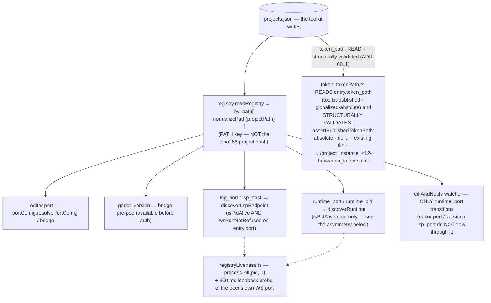
*Figure 11 — the registry consume path · verified 0ad6009*

**Path key, not hash.** `by_path` is keyed by the **canonical project path**; the server
forms the same key via `normalizePath` (backslash → `/`, strip trailing `/`, lowercase on
Windows/macOS). It does **not** recompute the sha256 12-char hash — that is a
toolkit-internal filename token. **Token-path authority flipped (ADR 0011)**: the server now
**reads** `entry.token_path` — the toolkit-published, **globalized-absolute** path — and
**structurally validates** it (`assertPublishedTokenPath`: absolute, no `..`, an existing
regular file, and a `…/project_instance_<12-hex>/mcp_token` suffix — a *format* check, never a
recomputed hash). The old independent derivation (`resolveTokenPath` / `resolveProjectName`)
was **deleted**; honoring the published path is what makes a relocated `user://`
(`use_custom_user_dir`) resolve, closing a silent `AUTH_FAILED`. `GODOT_MCP_TOKEN_PATH` remains
an operator override (read directly, bypassing the suffix check). The server reads `port`,
`godot_version`,
`runtime_port` / `runtime_pid`, and `lsp_port` / `lsp_host`, and tolerates
stale / runtime-only / ping-pong entries gracefully. The `diffAndNotify` watcher reacts
**only** to `runtime_port` transitions.

**Liveness is read at two strengths, and the asymmetry is deliberate.** The base check is
`isPidAlive` (`process.kill(pid, 0)` — reliable on Windows, unlike the toolkit's
`OS.is_process_running`), which proves only that *some* signalable process holds that
number, not that it is still the editor that wrote the entry. `discoverRuntime` stops
there: a runtime entry advertises `port: -1` (nothing to probe), a wrong runtime port
announces itself through a failed connect plus the channel's own per-instance auth
handshake, and that path runs on **every** runtime RPC. LSP claimants go further and are
corroborated against the WS command port their own entry advertises (ADR 0025,
[§9](#9-the-gdscript-lsp-client)), because reaching the wrong editor's language server
returns another project's symbols with no protest — and that resolution runs **once per
connection**, so it can afford a probe. The toolkit itself has no dead-entry GC (its
`OS.is_process_running` false-negatives on live sibling editors), so `by_path` accumulates
stale editor rows and the reader is the only place either check can happen.

---

## 12. Cross-version compatibility

`shared/version.ts` holds pure helpers (the server's own version, Godot version gating,
and a semver severity compare for the handshake). The supported floor is **Godot 4.2**
through the tested maximum (4.7 since 41n-octies); a forward-compat warning fires when the
engine is newer than tested. **Version acquisition**: the editor ack carries
`godot_version` (the dogfood path); otherwise the bridge pre-populates it from the registry
entry before auth.

<!-- data-depicts="src/registration/toolRegistry.ts src/shared/version.ts src/transport/bridge.ts src/startup/reconcile.ts" data-verified="d1c2a70" -->
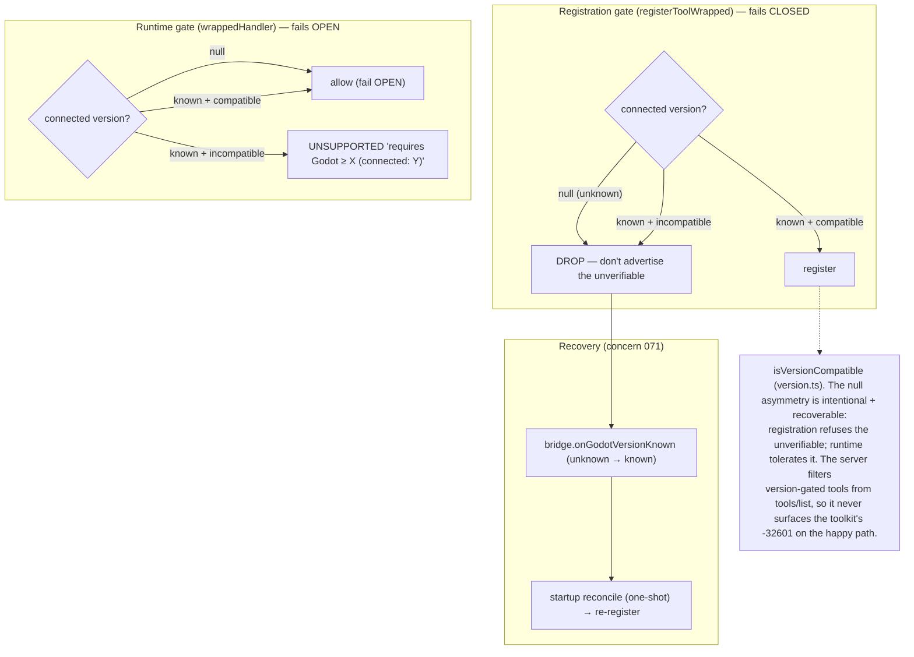
*Figure 12 — the version dual-gate · verified d1c2a70*

The dual gate (concern 071, fixed via "option e") has a deliberate **null asymmetry**: the
**registration gate** fails **CLOSED** on an unknown version (drop the tool — recoverable
once the version resolves via `bridge.onGodotVersionKnown` + the one-shot startup
`reconcile`), while the **runtime gate** fails **OPEN** on null (returns `UNSUPPORTED` only
when the version is known *and* incompatible). Because the server filters version-gated
tools out of `tools/list` at registration, it never surfaces the toolkit's `-32601`
version-block on the happy path.

---

## 13. The extension system

The server **projects** each toolkit extension command into an MCP tool (full-trust per
ADR 0009). `extensions.ts` is a pure-composition facade over one shared registrar (the
single known-extension ledger), the discovery service, and the change-application service
— so the ledger stays one consistency boundary.

<!-- data-depicts="src/extensions/extensions.ts src/extensions/extensionDiscovery.ts src/extensions/extensionRegistrar.ts src/extensions/extensionChanges.ts src/groups/extensionGroups.ts src/registration/extensionCollision.ts" data-verified="d1c2a70" -->
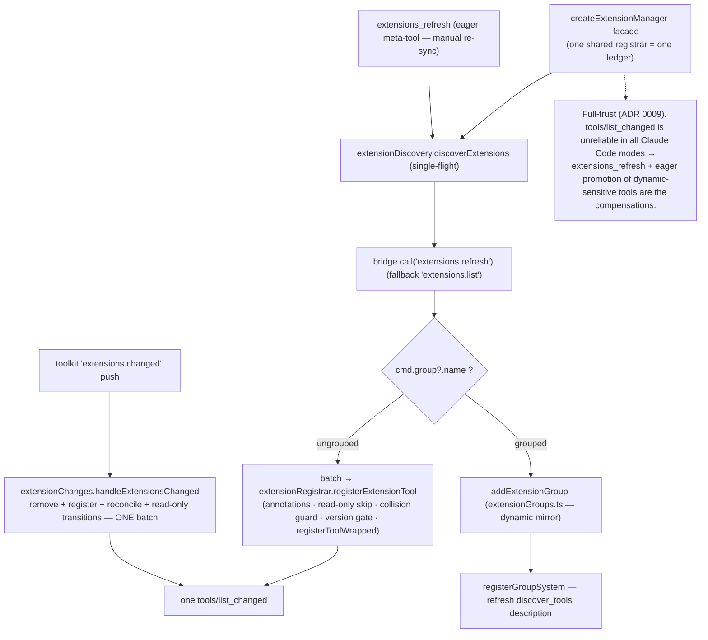
*Figure 13 — the extension lifecycle (consumer projection) · verified d1c2a70*

`extensionDiscovery` reads the toolkit's `extensions.refresh` (falling back to
`extensions.list`), builds `{ readOnlyHint / destructiveHint / idempotentHint ?? false }`
annotations, applies the read-only skip, and routes each command to
`registerToolWrapped` (ungrouped, batched) or `addExtensionGroup` (grouped, the dynamic
`extensionGroups` mirror). Every extension name is **collision-guarded** first
(`extensionNameCollides` — a name that is already a built-in *or* already registered is
**skipped with a warning**, the incumbent always winning and never crashing) at all four
registration sites, so a clash can't abort the batch — the MCP SDK's `registerTool` **throws**
on a duplicate (defence-in-depth under the [ADR 0009](#16-key-decisions) full-trust model).
Discovery is **single-flight** (a concurrent caller joins the in-flight pass) and the eager
boot pass is deadline-wrapped. **Live reconcile**: the
toolkit's `extensions.changed` broadcast → `extensionChanges.handleExtensionsChanged`
applies the whole delta (removes, adds, in-place updates, read-only transitions) inside
**one batch** → one `tools/list_changed`. `extensions_refresh` is the always-on meta-tool
the LLM calls to force a manual re-sync — load-bearing because `tools/list_changed` is
dropped in all Claude Code modes.

---

## 14. Distribution & packaging

The server ships as the scoped public ESM npm package `@npgamedev/godot-mcp-server`
(`bin: godot-mcp-server → dist/index.js`), with 3 runtime deps
(`@modelcontextprotocol/sdk`, `ws`, `zod`). The **`files` whitelist governs** (there is
no `.npmignore`): `dist` + `README.md` + `LICENSE` + `ATTRIBUTIONS.md`. So `dist` is
git-ignored and rebuilt by `prepublishOnly → build → postbuild (add-shebang)`, and
`src/`, **`/docs` (this architecture doc plus the typedoc `docs/api/`)**, `scripts/`, and
`test/` all stay out of the package — which is exactly why this architecture document is
**unshipped**. `--tools-count` and `--list-eager` are early-exit CLIs for audits. Pattern B: the toolkit
ships via the Godot Asset Library, the server via npm, so users never fetch what they
don't need.

---

## 15. Contract surface

The **contract surface** is the published language the two repos share — the part the
server depends on and is not free to change unilaterally. It is catalogued in full (with
field types, example payloads, and stability tiers) in the 41n contract-surface document;
the as-built cross-repo reconciliation lands in 41n-ter, after which this doc cross-links
the toolkit's `docs/dev/contract.md`. The consumer-side headline rows:

| # | Contract | Tier |
|---|----------|------|
| C1 | WebSocket transport & framing (ports, bind, buffer) | public |
| C2 | Auth handshake (first-frame token; mode-divergent reply) | public |
| C3 | Response envelope (`success` / `error` shape) | public |
| C4 | Error-code vocabulary (own string-tolerant `ErrorCode`) | public |
| C5 | Dispatch + concurrency notifications (`_queued` / `_executing` / `_cancel`; id coercion; JSON-RPC codes) | public |
| C6 | Idempotency (`status` + `if_exists`) | public |
| C7 | Type-tag coercion vocabulary (request-path only) | public |
| C8 | Tool names & param schemas (`domain.verb` ⟷ snake_case) | public |
| C9 | Read-only model (server-authoritative; published annotations) | public |
| C10 | Environment variables | public |
| C11 | `.mcp.json` file format | public |
| C12 | Tool group names | semi-public |
| C13 | Extension API (annotations; version bounds; group projection) | semi-public |
| C14 | Extension surface signaling (`extensions.list` / `refresh` / `changed`) | semi-public |
| C15 | LSP status round-trip (server → toolkit `set_lsp_status`) | semi-public |
| C16–C22 | `projects.json` format, project hash, token-path discovery, LSP / runtime publishing, untrusted envelope, ProjectSettings keys | internal |

Tiers feed semver: **public** = a break is a major bump; **semi-public** =
deprecate-then-change in a minor; **internal** = no guarantee.

---

## 16. Key decisions

The server has **no `docs/adr/`** — ADRs live in the
[toolkit repo](https://github.com/NPGameDev/godot-mcp-toolkit). The ones most relevant to
this document:

| Decision | Where it shows up |
|----------|-------------------|
| [Extension annotation API (shipped guide)](https://github.com/NPGameDev/godot-mcp-toolkit/blob/main/addons/godot_mcp_toolkit/docs/extending.md) | [§13](#13-the-extension-system) |
| [ADR 0008 — LSP port discovery is registry-authoritative](https://github.com/NPGameDev/godot-mcp-toolkit/blob/main/docs/adr/0008-lsp-port-registry-authoritative.md) | [§9](#9-the-gdscript-lsp-client) |
| [ADR 0009 — filesystem-content trust boundary; extensions full-trust](https://github.com/NPGameDev/godot-mcp-toolkit/blob/main/docs/adr/0009-fs-content-trust-boundary.md) | [§8](#8-security--trust-boundaries), [§13](#13-the-extension-system) |
| [ADR 0011 — token-path authority (toolkit publishes globalized-absolute; server reads + structurally validates)](https://github.com/NPGameDev/godot-mcp-toolkit/blob/main/docs/adr/0011-token-path-authority.md) | [§4](#4-transport-the-websocket-bridge), [§11](#11-multi-project-registry) |

Server-side decisions worth recording:

| Decision | Rationale |
|----------|-----------|
| The own, string-tolerant `ErrorCode` union | Forward any plugin code verbatim while keeping a typed superset that also names bridge-origin codes ([§6](#6-the-response--error-contract)) |
| The REFLECT posture | Forward the toolkit's result verbatim — no response re-encode ([§6](#6-the-response--error-contract)) |
| `discover_tools` over profiles + tool-packs | One LLM-driven on-demand surface instead of static profiles ([§7](#7-tool-surface-management-discover_tools)) |
| Registry-driven, never-blind discovery | Resolve every endpoint by path from `projects.json`; never scan blindly ([§1](#1-the-big-picture), [§9](#9-the-gdscript-lsp-client), [§11](#11-multi-project-registry)) |

---

*This architecture document is part of the server repo and is not shipped in the npm
package. The toolkit's architecture is documented separately in the
[`godot-mcp-toolkit`](https://github.com/NPGameDev/godot-mcp-toolkit) repo.*
